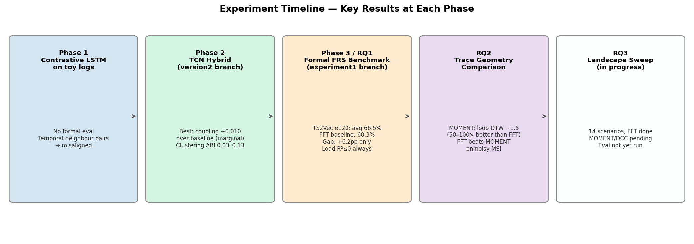
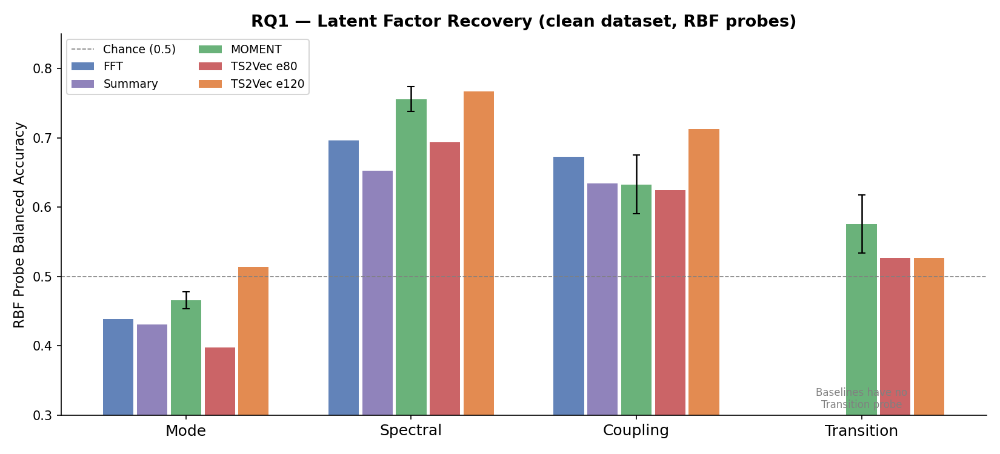
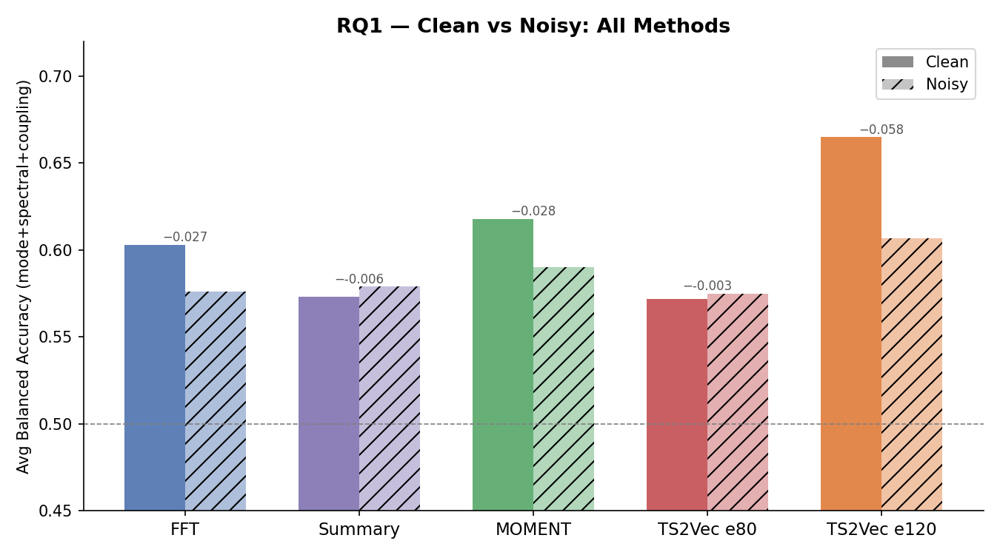
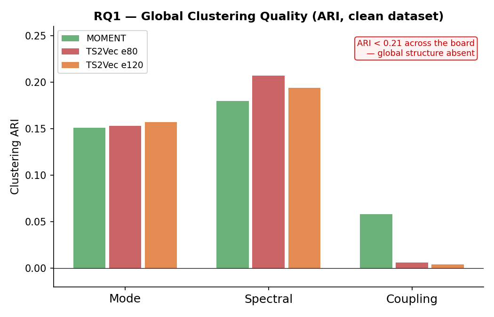
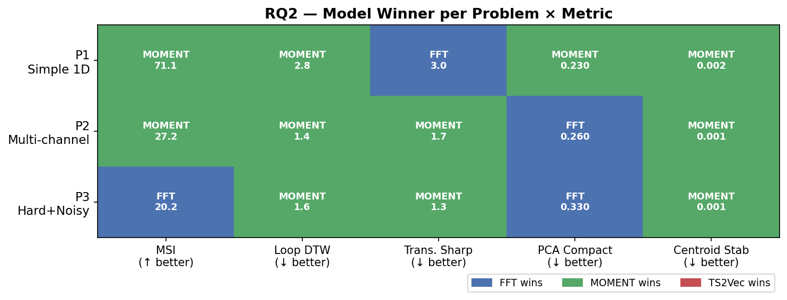
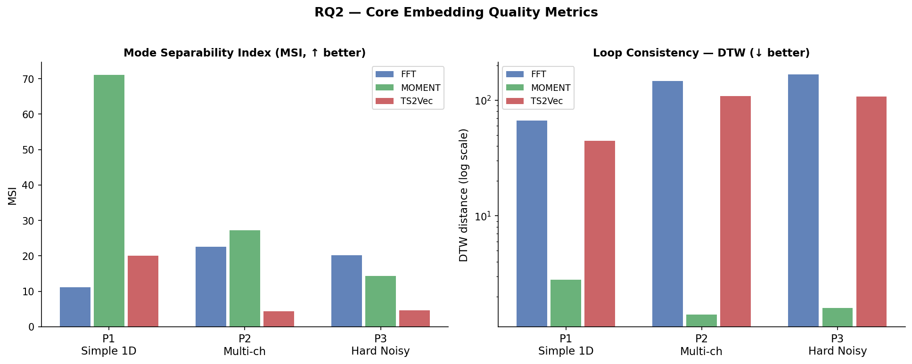
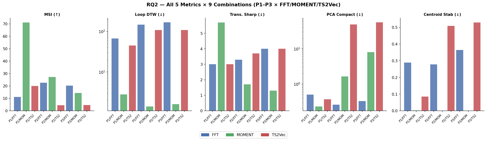
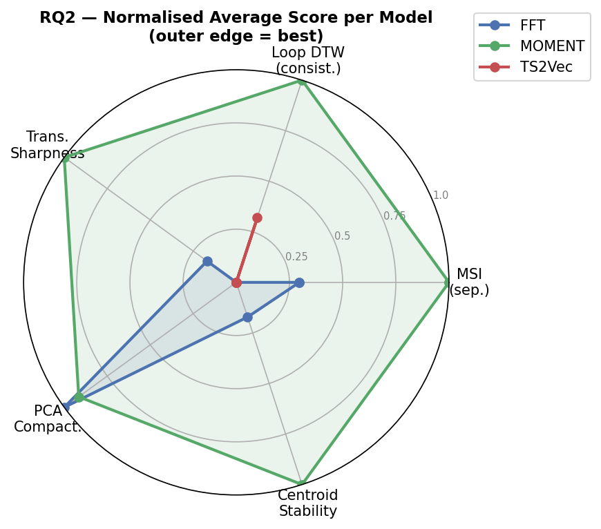
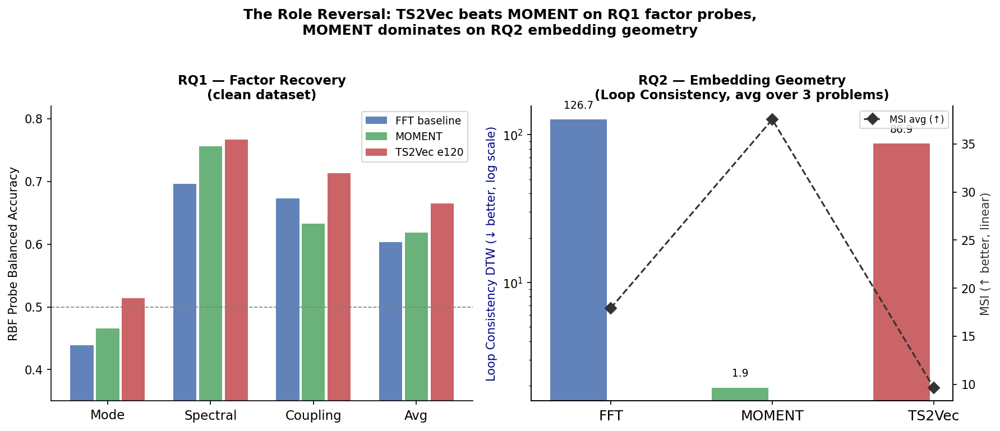

# Log-to-Vec Benchmark — Comprehensive Research Report

*Generated: 2026-05-05*

---

## 1. Project Goal

Learn useful **embeddings of PLC/SCADA log files** for mode-change detection and regime
identification in industrial control systems. The logs are timestamped records of sensor readings
and discrete machine state codes — essentially serialised multivariate time series with no
meaningful free text.

The motivating question: can a learned representation capture operating regime, load, and
mode-change structure **without hand-labelled data**, well enough to be useful downstream?

---

## 2. Experiment History at a Glance



---

## 3. Phase 1 — Contrastive LSTM on Toy Logs

**Setup**
- LSTM encoder trained with NT-Xent contrastive loss.
- Positive pairs: temporal neighbours within a trajectory.
- Data: toy CSV logs generated synthetically (`data/toy_logs.csv`); sine-wave generator examples.
- Evaluation: ad-hoc clustering and retrieval visualisations only. No formal metric suite.

**Outcome**
No quantitative results recorded. Discontinued because:
1. Temporal-neighbour positives teach "what is nearby in time", not "what shares a mode".
2. Toy logs had no ground-truth factorised labels — claims about quality were unverifiable.

**Lesson:** A controlled synthetic benchmark with known latent structure is a prerequisite before
any learning claim can be made.

---

## 4. Phase 2 — TCN Hybrid on FSSS (version2 branch)

**Setup**
- TCN (Temporal Convolutional Network) with dilated residual conv blocks.
- Hybrid loss: NT-Xent contrastive + reconstruction (masked span, Gaussian noise, time shift).
- Data: FSSS datasets — earlier, smaller synthetic variants of FRS.
- Formal eval suite added: linear and RBF probes, retrieval@K, clustering ARI.
- Baselines: raw statistics, FFT, PCA.

**Results (RBF probe balanced accuracy)**

| Factor      | Baseline (best) | Learned (best) | Delta |
|-------------|-----------------|----------------|-------|
| mode_id     | 0.277           | 0.267          | −0.010 — **baseline wins** |
| spectral_id | 0.701           | 0.653          | −0.048 — **baseline wins** |
| coupling_id | 0.413           | 0.423          | +0.010 — marginal |
| transition  | 0.558           | 0.534          | −0.024 — **baseline wins** |
| mean_load   | ≈0              | ≈0             | tied at zero |

Retrieval R@5 was misleadingly high (0.961–0.993) due to temporal-neighbour training bias.
Clustering ARI was very poor (0.020–0.134).

**Lesson:** TCN + temporal-neighbour contrastive + reconstruction does not extract factorised
structure. The objective is misaligned with the evaluation goal. Baselines are formidable.

---

## 5. Phase 3 / RQ1 — Formal FRS Benchmark

### 5.1 Dataset

**FRS (Factorised Regime Sequence)** — a controlled synthetic benchmark with known latent structure.

Each trajectory is governed by three independent latent factors:
- **Mode ID** — discrete operating regime (sine-wave pattern per channel)
- **Spectral ID** — frequency configuration
- **Coupling ID** — cross-channel interaction strength
- **Load** — continuous amplitude modulation (hardest)

Two datasets: `frs_clean_vnext_long` (σ_noise = 0.05) and `frs_noisy_vnext_long` (σ_noise = 0.20).
Both use a **trajectory-level 70/15/15 split** to prevent leakage.

### 5.2 Methods

| Method | Description | Seeds |
|--------|-------------|-------|
| MOMENT (pretrained) | Foundation model, 768-dim embeddings, frozen | 3 (42/53/64) |
| TS2Vec-style e80 | Trained from scratch, 64-dim, 80 epochs | 1 |
| TS2Vec-style e120 | Same, tuned to 120 epochs | 1 |
| FFT baseline | Per-channel amplitude spectrum, 14–56 dim | 1 |
| Summary baseline | Mean, std, min, max, per channel | 1 |

### 5.3 Evaluation Suite

- **Probes**: linear and RBF SVM probes for each latent factor → balanced accuracy
- **Retrieval**: precision@10 for each factor
- **Clustering**: K-Means ARI for each factor
- **Transition**: detection of mode-change windows

### 5.4 Results



**Table 1 — RBF Probe Balanced Accuracy (clean dataset)**

| Method           | Mode  | Spectral | Coupling | Transition | Load R² |
|------------------|-------|----------|----------|------------|---------|
| FFT baseline     | 0.439 | 0.696    | 0.673    | —          | −0.006  |
| Summary baseline | 0.431 | 0.653    | 0.634    | —          | −0.006  |
| MOMENT           | 0.466 ±0.012 | 0.756 ±0.018 | 0.633 ±0.042 | 0.576 ±0.042 | −0.037 ±0.049 |
| TS2Vec e80       | 0.398 | 0.694    | 0.625    | 0.527      | −0.006  |
| **TS2Vec e120**  | **0.514** | **0.767** | **0.713** | 0.527 | −0.006 |



**Table 2 — Average balanced accuracy (mode + spectral + coupling)**

| Method           | Clean | Noisy | Drop  |
|------------------|-------|-------|-------|
| FFT baseline     | 0.603 | 0.576 | −0.027 |
| Summary baseline | 0.573 | 0.579 | +0.006 |
| MOMENT           | 0.618 | 0.590 | −0.028 |
| TS2Vec e80       | 0.572 | 0.575 | +0.003 |
| **TS2Vec e120**  | **0.665** | **0.607** | −0.058 |

The margin of the best learned method over the best baseline is only **+6.2 pp** on clean data,
narrowing to **+3.1 pp** on noisy data.



**Table 3 — Clustering ARI (K-Means, clean dataset)**

| Method      | Mode  | Spectral | Coupling | Avg   |
|-------------|-------|----------|----------|-------|
| MOMENT      | 0.151 | 0.180    | 0.058    | 0.130 |
| TS2Vec e80  | 0.153 | 0.207    | 0.006    | 0.122 |
| TS2Vec e120 | 0.157 | 0.194    | 0.004    | 0.118 |

Global clustering quality is uniformly poor (ARI < 0.21). More epochs (e80→e120) helps probes
but **degrades** coupling clustering.

**Critical finding: Load is completely unlearned.** Load R² ≤ 0 for every method in every setting.

---

## 6. RQ2 — Trace Geometry Comparison

### 6.1 Setup

Three synthetic problems modelled after CNC-machining analogies:

| Problem | Description | Channels | Noise |
|---------|-------------|----------|-------|
| P1 — Simple 1D | Clearly separated frequencies | 1 | low |
| P2 — Multi-channel | Cross-channel frequency mixing | 4 | low |
| P3 — Hard Noisy | Similar frequencies, high noise | 4 | σ=0.20 |

Same three models evaluated: FFT, MOMENT, TS2Vec.

**Key question:** Does the embedding produce geometrically coherent, mode-separable traces that
form closed loops in PCA space?

### 6.2 Metrics

| Metric | Symbol | Direction | Meaning |
|--------|--------|-----------|---------|
| Mode Separability Index | MSI | ↑ better | Inter-mode distance / intra-mode spread |
| Loop Consistency | Loop DTW | ↓ better | DTW distance between repeated mode traces |
| Transition Sharpness | Trans. Sharp | ↓ better | Windows to cross midpoint after a mode change |
| PCA Compactness | PCA Compact | ↓ better | Convex hull area of mode loop in PC1–PC2 |
| Centroid Stability | Centroid Stab | ↓ better | Std of per-run mode centroids |

### 6.3 Results

**Full metric table:**

| | MSI ↑ | Loop DTW ↓ | Trans. Sharp ↓ | PCA Compact ↓ | Centroid Stab ↓ |
|---|---|---|---|---|---|
| P1 / FFT    | 11.1   | 66.6   | **3.0**  | 0.50  | 0.289 |
| P1 / MOMENT | **71.1** | **2.76** | 5.7 | **0.23** | **0.002** |
| P1 / TS2Vec | 20.0   | 44.6   | 3.0  | 0.37  | 0.085 |
| P2 / FFT    | 22.5   | 146.1  | 3.3  | **0.26** | 0.278 |
| P2 / MOMENT | **27.2** | **1.43** | **1.67** | 1.63 | **0.001** |
| P2 / TS2Vec | 4.4    | 108.2  | 3.67 | 48.4  | 0.509 |
| P3 / FFT    | **20.2** | 167.4 | 4.0  | **0.33** | 0.364 |
| P3 / MOMENT | 14.3   | **1.64** | **1.33** | 7.97 | **0.001** |
| P3 / TS2Vec | 4.6    | 107.8  | 4.0  | 55.9  | 0.529 |









### 6.4 Key Findings

**1. MOMENT's loop consistency is extraordinary.**
MOMENT produces loop DTW of 1.4–2.8 across all three problems, vs 66–167 for FFT and 44–108 for
TS2Vec — roughly 20–100× better. Mode traces are tight, repeatable closed orbits in PCA space.
This is exactly the property needed for online anomaly detection.

**2. MOMENT centroid stability is near-zero.**
Centroid stability 0.001–0.002 vs 0.08–0.53 for others. Mode regions don't drift between
different test trajectories — critical for a reference-based detector.

**3. FFT beats MOMENT on MSI in the hard noisy case (P3): 20.2 vs 14.3.**
This is the key surprise. MOMENT's pretrained features can't separate modes when frequencies are
close and noise is high, whereas the raw spectrum remains more discriminative. MOMENT still wins
on loop consistency and transition sharpness even in P3 — the modes are compact and transitions
are fast, but they overlap more in PCA space.

**4. TS2Vec is consistently the worst.**
Low MSI (4.4–20.0), catastrophic PCA compactness on multichannel (48–56 vs FFT's 0.26–0.33),
centroid stability 0.09–0.53. The 64-dim trained representation fails to find useful geometry
in these problems.

**5. MOMENT's PCA compactness degrades on multichannel noisy data.**
P2: 1.63, P3: 7.97 vs FFT's 0.26, 0.33. Likely a dimensionality projection artefact — projecting
768 dims to 2 PCA dims may scatter loops — rather than a fundamental embedding failure, since
loop consistency and centroid stability remain excellent.

---

## 7. Cross-Experiment Synthesis — The Role Reversal



One of the most striking findings is a **role reversal between MOMENT and TS2Vec** across the two
experiments:

| | RQ1 (factor recovery probes) | RQ2 (embedding geometry) |
|--|--|--|
| MOMENT | 61.8% avg balanced acc — **middle** | Loop DTW ~1.5 — **dominant** |
| TS2Vec e120 | 66.5% avg balanced acc — **best** | Loop DTW ~87 — **worst** |

**Interpretation:**
- TS2Vec's contrastive training explicitly pushes same-window representations together and pulls
  different windows apart, which helps linear/RBF probes recover discrete factor labels.
  But the geometry is chaotic — loops don't form, centroids drift.
- MOMENT's pretrained features produce geometrically regular embeddings — tight, stable, fast
  mode transitions — even without any task-specific training. But its 768-dim space doesn't
  encode fine-grained discrete factor boundaries as sharply as TS2Vec's trained 64-dim space.

These are **complementary strengths**: TS2Vec for discrete label recovery; MOMENT for
continuous online monitoring and anomaly detection.

---

## 8. RQ3 — Landscape Sweep (in progress)

### 8.1 Setup

14 systematically varied scenarios exploring the failure modes of each embedding:

| Axis | Levels |
|------|--------|
| Baseline | 3-mode, 4-channel, low noise, no missing |
| Missing data | rand 10%, rand 30%, block 30%, channel missing |
| Noise | σ=0.00, 0.20, 0.40 |
| Number of modes | 2, 5, 8 |
| Signal type | sine, step, mixed |

### 8.2 Current status

- **Data generation**: complete for all 14 scenarios
- **FFT embeddings (fft8, fft32)**: complete for all 14 scenarios
- **MOMENT embeddings**: pending (cluster jobs `rq3_moment.slurm`)
- **DCC embeddings**: pending (cluster jobs `rq3_dcc.slurm`)
- **Metrics, plots, report**: empty — requires all embeddings first

The eval pipeline (`rq3_eval.slurm`) is ready to run on the login node once embeddings land.

---

## 9. Lessons Learned

### 9.1 Method design

| # | Lesson | Evidence |
|---|--------|----------|
| L1 | Temporal-neighbour contrastive pairs teach temporal proximity, not mode identity. Don't use them without modification. | Phase 1 and 2: baselines beat learned |
| L2 | Reconstruction loss adds complexity but doesn't fix misaligned objectives. | Phase 2 vs Phase 1: no meaningful improvement |
| L3 | More epochs help probes but can harm global structure. | TS2Vec e80→e120: coupling ARI 0.006 → 0.004 |
| L4 | Pretrained foundation models give strong geometry without task-specific training, but may miss fine-grained factor boundaries. | RQ1/RQ2 role reversal |
| L5 | Load (continuous amplitude) is not learnable from the current setup — every method gives R²≤0. Factor-aware pairs or auxiliary regression needed. | RQ1 Table 1 |

### 9.2 Evaluation design

| # | Lesson | Evidence |
|---|--------|----------|
| L6 | Retrieval R@K is misleading when the training objective biases nearest neighbours. Always check clustering ARI alongside retrieval. | Phase 2: R@5 > 0.96 but probe accuracy 27% |
| L7 | Single-seed results for TS2Vec should be treated cautiously. Variance across seeds can be substantial. | MOMENT coupling std ±0.042 — only method with multi-seed data |
| L8 | Geometry metrics (loop consistency, centroid stability) reveal embedding quality that probe accuracy misses entirely. | MOMENT dominates RQ2 while being middle of pack in RQ1 |
| L9 | PCA compactness may penalise high-dimensional embeddings unfairly — a 768→2 projection loses more than a 64→2 one. Consider using all-pairs silhouette or t-SNE compactness instead. | MOMENT PCA compact 1.63–7.97 vs FFT 0.26–0.33, despite better loop consistency |

### 9.3 Benchmark design

| # | Lesson | Evidence |
|---|--------|----------|
| L10 | FRS is a valid scientific instrument for the core learning problem, but does not capture named channels, irregular sampling, or mixed discrete/continuous channels from real PLC logs. | Gap analysis in RETROSPECTIVE.md |
| L11 | High baseline performance (FFT avg 60.3%) indicates the task has strong spectral structure — learned methods must beat this by a meaningful margin to justify their complexity. | RQ1 Table 4: +6.2pp gap |
| L12 | Missing data and noise stress-testing (RQ3) is necessary before recommending any method for production — clean-data rankings may not hold under degradation. | RQ3 motivation |

---

## 10. Open Questions

1. **Will MOMENT's MSI advantage recover under the RQ3 landscape sweep?** FFT beat MOMENT on P3
   MSI — does this generalise to the block-missing or high-noise scenarios in RQ3?

2. **Why does more TS2Vec training degrade coupling clustering while improving probes?** The mode
   representations become more linearly separable but globally less organised — suggests the
   contrastive loss is collapsing intra-mode variance selectively.

3. **Is MOMENT's poor PCA compactness a projection artefact or a real geometry problem?** Would
   all-pairs silhouette score in the full 768-dim space tell a different story?

4. **Can factor-aware pairs fix the load problem?** Windows with matching load values as positives
   instead of temporal neighbours — the most direct fix for open problem #3 (Load R²≤0).

5. **Does the FFT-vs-MOMENT MSI reversal on noisy data matter for the actual application?**
   MOMENT still has faster transitions and more stable centroids even on P3. For online monitoring,
   loop consistency may matter more than MSI.

---

## 11. Existing Visualisations

RQ2 individual model plots are already available (45 files, 5 plot types × 9 combinations):

```
experiments/rq2_trace_comparison/plots/{p1_simple_1d,p2_multichannel,p3_hard_noisy}/{fft,moment,ts2vec}/
  ├── *_worm.png              — trajectory trace through PCA space
  ├── *_mode_loops.png        — per-mode closed loops overlaid
  ├── *_centroids.png         — mode centroids in PCA space
  ├── *_distance_heatmap.png  — pairwise embedding distances
  └── *_centroid_distance.png — centroid distance over time
```

Most visually informative contrasts:
- `p1_simple_1d_moment_mode_loops.png` — best case (MOMENT dominant)
- `p3_hard_noisy_fft_mode_loops.png` — the surprise (FFT wins MSI on hard problem)
- `p2_multichannel_ts2vec_mode_loops.png` — worst case (TS2Vec geometry collapse)

---

## 12. Next Steps

### Immediate (unblock RQ3)
1. Check whether `rq3_moment.slurm` and `rq3_dcc.slurm` jobs have completed on Alvis.
2. Sync results back, run `rq3_eval.slurm` on login node.

### Track A — FRS pipeline fixes (highest priority)
- **A1**: Factor-aware positive pairs for TS2Vec (fix load and coupling learning)
- **A2**: Load regression auxiliary head
- **A4**: Multi-seed TS2Vec to quantify variance
- **A3**: OOD splits (unseen factor combinations at test time)

### Track B — PLC log bridge
- **B1**: Synthetic PLC log corpus with FRS-like factors
- **B2**: Tabular/numerical embedding extraction
- **B3**: Cross-modal comparison with FRS eval infrastructure

### Track C — Geometry analysis
- Replace PCA compactness with silhouette score in full embedding space
- Investigate MOMENT's loop consistency advantage: is it universal or data-dependent?
